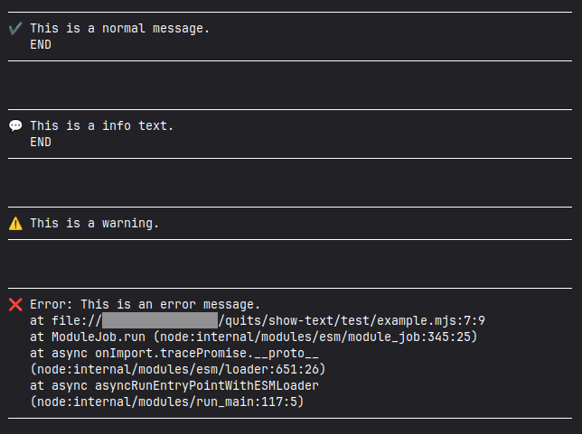
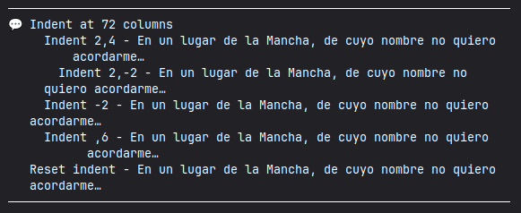

# @quitsmx/show-text

Displays multiline text in the console, with icon and word wrap.

[![Test on Github][test-badge]][test-url]
[![NPM Version][npm-badge]][npm-url]
[![Install size][size-badge]][size-url]
[![License][license-badge]][license-url]

Make your messages more visible and offer a less crude alternative to a simple "throw".

## Requirements

Node.js 18.18.0 or above.

Should work with Bun 1.2.23 and Deno 2.5.2, although I don't use them.

Does **not work** in browsers.

## Install

With your favorite package manager, for example:

```bash
pnpm add @quitsmx/show-text
```

## API

There are 4 functions, all of which accept one or more blocks of text:

| Function        |       Icon       | Use             |
| --------------- | :--------------: | --------------- |
| `showText`      | &#x2714;&#xFE0F; | `console.log`   |
| `showInfoText`  |    &#x1F4AC;     | `console.info`  |
| `showWarnText`  | &#x26A0;&#xFE0F; | `console.warn`  |
| `showErrorText` |     &#x274c;     | `console.error` |

The received text is normalized by joining it into a single string and separating it back into lines, tabs are converted to spaces and other control characters and surrounding spaces are removed.

Fixed margins are 4 columns on the left and 1 on the right.
The minimum supported width is 40 columns, leaving 35 usable. The maximum is 240, and the default is 80 if the output provides no information.

On lines where the text overflows, line wrapping is performed _without attempting_ to break large words, so unwanted word breaking sometimes occurs.

Smarter line wrapping and consideration of non-standard width characters will be attempted in a future release.

### Indentation

Basic indentation is supported through the `<#D1,D2>` statement, where `D1` is the _primary indentation_ (of the first line) and `D2` is the _secondary indentation_ (of wrapped lines) relative to the primary indentation.

While `D1` is additive (or subtractive with negative numbers), `D2` overwrites the secondary indent value.

The default value for `D1` is `0` and `D2` is `undefined`, which preserves the primary and secondary indentation, respectively.

The shortcut `"<#->"`, resets both indentations to `0`.

The limits of the main indentation are 0 to 40% of the _usable area_ of ​​the output, which is the total width minus 5 columns of margins. Any indentation outside that range is adjusted silently.

Secondary indentation is limited so that a minimum of 20 characters can be displayed at a maximum of the usable width of the output.

For the statement to take effect, it must be unique on its own line.

## Examples 1

This example shows basic usage in an 80-column console...

```js
import { showErrorText, showInfoText, showText, showWarnText } from '@quitsmx/show-text'

try {
  showText('This is a normal message.', 'END')
  showInfoText('This is a info text.\n END')
  showWarnText('This is a warning.')
  throw new Error('This is an error message.')
} catch (error) {
  showErrorText(error)
  process.exitCode = 1
}
```

Output:



### Example 2

This example shows indentation control in a 72-columns console.

```js
import { showInfoText } from '@quitsmx/show-text'

showInfoText(
  'Indent at 72 columns',
  '<#2,4>',
  'Indent 2,4 - En un lugar de la Mancha, de cuyo nombre no quiero acordarme…',
  '<#2,-2>',
  'Indent 2,-2 - En un lugar de la Mancha, de cuyo nombre no quiero acordarme…',
  '<#-2>',
  'Indent -2 - En un lugar de la Mancha, de cuyo nombre no quiero acordarme…',
  '<#,6>',
  'Indent ,6 - En un lugar de la Mancha, de cuyo nombre no quiero acordarme…',
  '<#->',
  'Reset indent - En un lugar de la Mancha, de cuyo nombre no quiero acordarme…',
)
```

Output:



## License

The [MIT License][license-url] © 2025-Present by QuITS

<!--[test-badge]:https:github.com/quitsmx/show-text/actions/workflows/test.yml/badge.svg-->

[test-badge]: https://img.shields.io/github/actions/workflow/status/quitsmx/show-text/test.yml?logo=github&logoColor=%23aaa
[test-url]: https://github.com/quitsmx/show-text/actions/workflows/test.yml
[npm-badge]: https://img.shields.io/npm/v/@quitsmx%2Fshow-text
[npm-url]: https://www.npmjs.org/package/@quitsmx/show-text
[size-badge]: https://packagephobia.com/badge?p=@quitsmx/show-text
[size-url]: https://packagephobia.com/result?p=@quitsmx/show-text
[license-badge]: https://img.shields.io/npm/l/@quitsmx%2Fshow-text?color=blue
[license-url]: LICENSE
